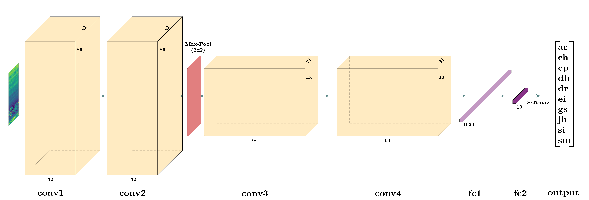
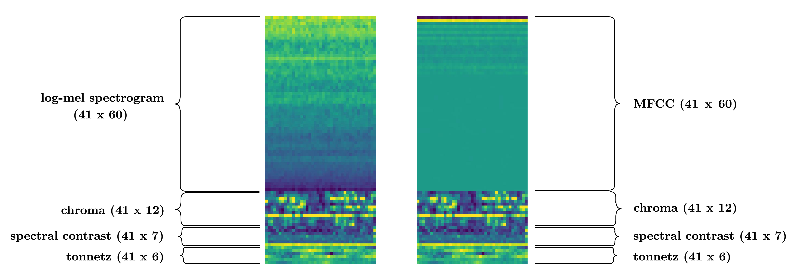

# environment-sound-classifer

This repository contains the code for a 4-layer convolutional neural network created for classifying environmental sound. It is trained and tested using the UrbanSound8K dataset, containing 10 different classes. A two-stream network is also implemented using a simple late fusion method.

The network is based on the paper: [Environment Sound Classification Using a Two-Stream CNN Based on Decision-Level Fusion by Su, Zhang, Wang & Madani](https://www.ncbi.nlm.nih.gov/pmc/articles/PMC6479959/)

Created with [@markergusnicholl](https://github.com/MarkErgusNicholl) as part of the *Applied Deep Learning* unit at the University of Bristol.

All code is written in Python 3.7 with the machine learning framework PyTorch. Models were trained with access to the University of Bristol's supercomputer BlueCrystal4.

## Input

The *log-mel spectrogram* and *mel frequency cepstral coefficent* (MFCC) are two of the most used auditory features. These two features form the basis of the two main feature combined inputs, called LMC and MC respectively. In addition, the features *chroma*, *spectral contrast* and *tonnetz* is appended to create the final input. A third input type, named “MLMC” is also used, combining all five features.

## Results

These are the per-class accuracies for the four different models:

## Setup

### Usage

1. Clone the repository
2. Download the [UrbanSound8K](https://urbansounddataset.weebly.com/urbansound8k.html) dataset used for this network:
	- [Training set](https://drive.google.com/open?id=1LwllHy7J56EoDLaGe_j0Unu_3SXt3OUA)
	- [Test set](https://drive.google.com/open?id=1fLjIZOLMnukx1g2BND8yuza5z-wRf2NL)
2. Place in `data/`
3. Run `python train.py --mode [LMC MC MLMC TSCNN]`
	- `TSCNN` (Two Stream Late Fusion) mode can only be run after LMC and MC models have been trained and saved to disk

### Other Arguments

|      Parameter      |      Argument     | Default |
|:-------------------:|:-----------------:|--------:|
|    Learning Rate    | `--learning-rate` |  0.001  |
|        Epochs       |  `--sgd-momentum` |   0.9   |
|      Batch Size     |   `--batch-size`  |   0.5   |
| Dropout Probability |    `--dropout`    |    32   |
|       Momentum      |  `--sgd-momentum` |    50   |

